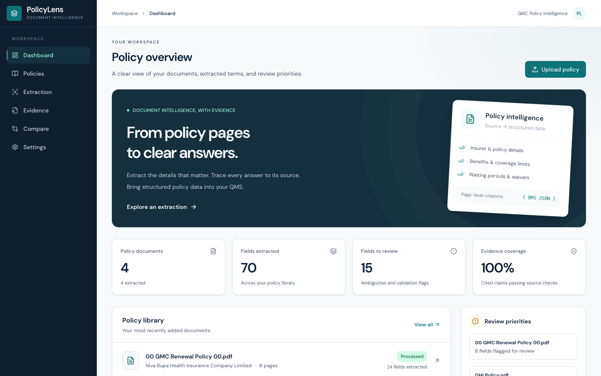
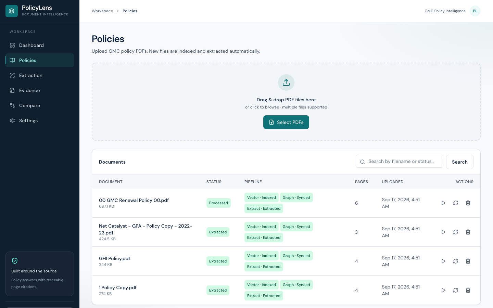
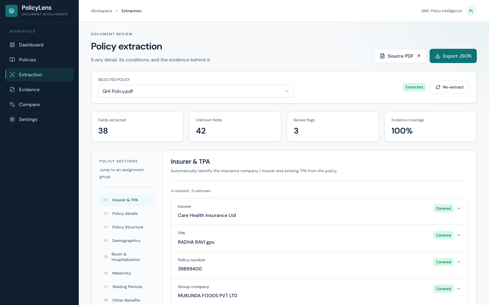
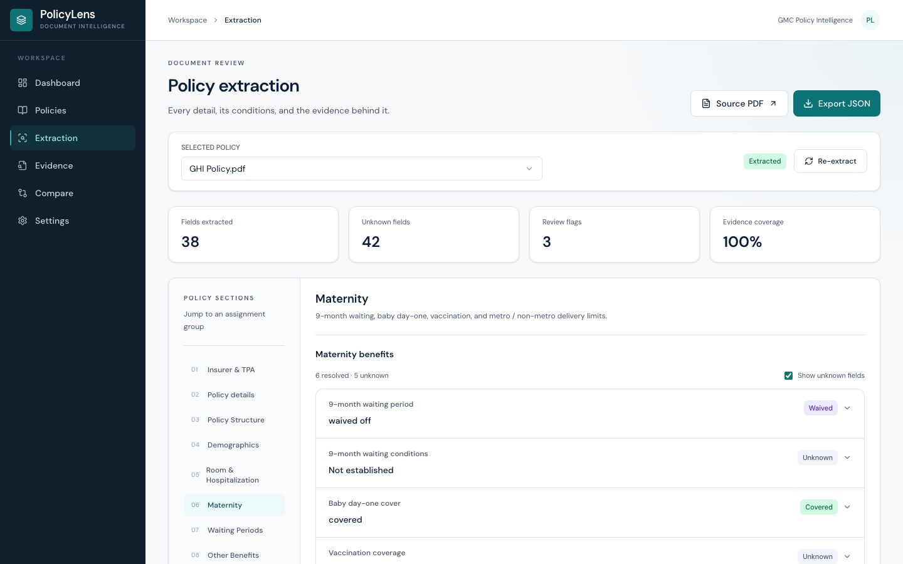
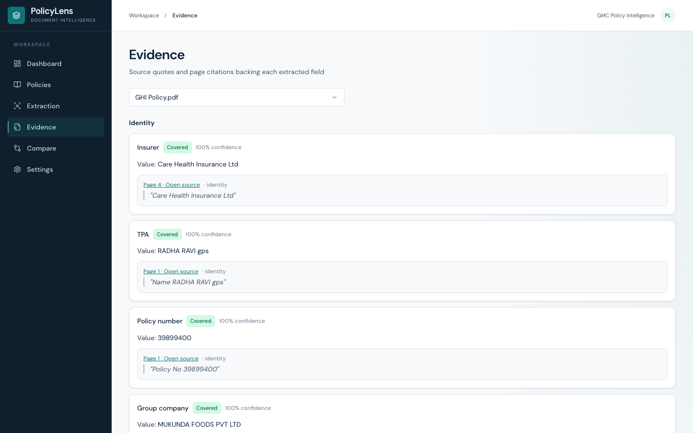
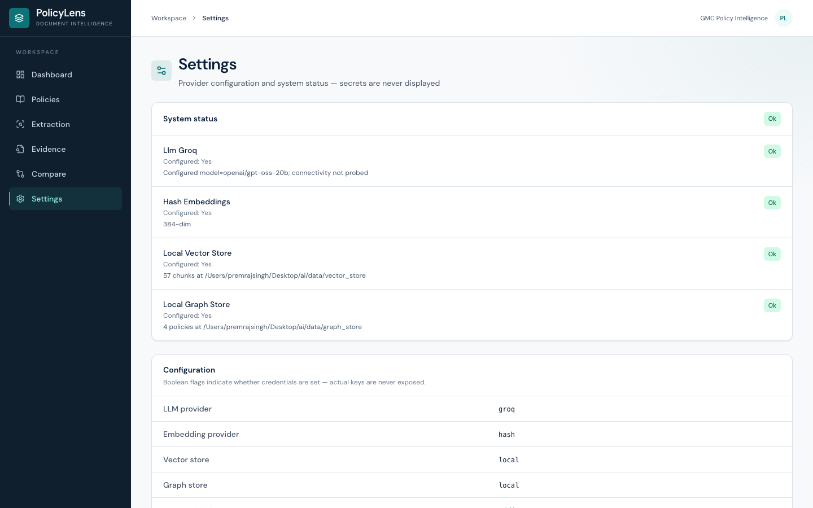
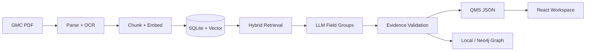

# PolicyLens

**Evidence-backed GMC policy extraction for Quality Management Systems**

Turn messy Group Medical Cover PDFs into structured, citation-linked QMS JSON — without hardcoding insurer templates.

[](https://norm-developer-theft-rom.trycloudflare.com)
[](https://www.python.org/)
[](https://fastapi.tiangolo.com/)
[](https://react.dev/)
[](https://www.typescriptlang.org/)

| | |
|---|---|
| **Live demo (working)** | [https://norm-developer-theft-rom.trycloudflare.com](https://norm-developer-theft-rom.trycloudflare.com) |
| **Render URL** | [https://policylens-cqm3.onrender.com](https://policylens-cqm3.onrender.com) — reconnect GitHub if deploy stays on old image |
| **Repository** | [github.com/premrajsingh/PolicyLens](https://github.com/premrajsingh/PolicyLens) |
| **Sample QMS JSON** | [`outputs/sample/`](outputs/sample/) |
| **Schema** | [`docs/QMS_SCHEMA.json`](docs/QMS_SCHEMA.json) · FieldValue v1.1.0 |

> Demo tunnel points at the local hydrate-first build (full Extracted). Free Render may still serve a stale image after repo recreate — Settings → Connect `premrajsingh/PolicyLens` → **Deploy latest commit**, or [new Blueprint deploy](https://render.com/deploy?repo=https://github.com/premrajsingh/PolicyLens).

---

## Why this exists

Insurance ops teams still re-key GMC schedules by hand. Carrier layouts change; rigid parsers break; “the LLM said so” is not audit-ready.

**PolicyLens** is a full-stack document-intelligence product that:

- Ingests real multi-page GMC / GPA PDFs  
- Retrieves the right passages (hybrid lexical + semantic search)  
- Extracts assignment-aligned field groups with an LLM  
- **Validates every non-null claim against page evidence**  
- Exports machine-readable **QMS JSON** ready for downstream systems  

Unsupported facts stay `null` with status `unknown`. Conflicts stay unresolved (`status=conflict`) with both citations retained. Values are **never invented** from general insurance knowledge.

---

## Product walkthrough

### Dashboard — portfolio at a glance


### Policies — upload, process, library


### Extraction — assignment field groups with status & evidence


### Maternity benefits — structured coverage, not free text


### Evidence — page-linked quotes for review


### Settings — providers you can swap without rewriting the app


---

## What managers care about

| Signal | What shipped |
|--------|----------------|
| **End-to-end ownership** | FastAPI + React workspace + Docker/Render deploy — not a notebook demo |
| **Auditability** | Every answered field carries page quotes; quotes must appear in stored page text |
| **Honest unknowns** | Missing clauses stay `unknown`; conflicts stay `conflict` — no silent guesses |
| **Schema discipline** | Stable FieldValue envelope + versioned [`QMS_SCHEMA.json`](docs/QMS_SCHEMA.json) |
| **Production pragmatism** | Local vector/graph by default; Groq for live extract; Pinecone / Neo4j optional |
| **Evaluability** | Pytest suite, frontend tests, CLI extract/validate, eval runner |

---

## Architecture



| Layer | Role |
|-------|------|
| **React + Vite + TypeScript** | Dashboard, Policies, Extraction, Evidence, Compare, Settings |
| **FastAPI** | Upload, process, extract, download, compare, health |
| **SQLite + FTS5** | Documents, pages, chunks, jobs, authoritative JSON |
| **Vector store** | Semantic retrieval — local by default; Pinecone optional |
| **Graph store** | Explainability — local by default; Neo4j optional |
| **LLM** | Structured extraction — Groq (live) / mock (offline) |

Deep dives: [`docs/ARCHITECTURE.md`](docs/ARCHITECTURE.md) · [`docs/EXTRACTION_METHODOLOGY.md`](docs/EXTRACTION_METHODOLOGY.md)

---

## Tech stack

| Area | Choice |
|------|--------|
| Backend | Python 3.12, FastAPI, SQLModel / SQLite |
| Frontend | React 18, TypeScript, Vite, Tailwind CSS |
| PDF | PyMuPDF, pdfplumber, optional Tesseract OCR |
| LLM | Groq (`openai/gpt-oss-120b` for published samples); OpenAI / Gemini adapters available |
| Embeddings | Hash (default demo) · Hugging Face · sentence-transformers |
| Retrieval | SQLite FTS5 + vector search (RRF merge; full text rehydrated from SQLite) |
| Deploy | Docker · Render Blueprint ([`render.yaml`](render.yaml)) |

---

## Extraction methodology

1. **Parse** — page text + tables; page numbers preserved  
2. **OCR** — when page text is below threshold and OCR is enabled  
3. **Chunk** — overlapping text/table chunks with section hints  
4. **Embed + index** — vector upsert with document isolation  
5. **Retrieve** — lexical FTS + semantic search, merged by reciprocal rank fusion  
6. **Extract** — LLM fills one field group at a time with evidence quotes  
7. **Validate** — schema shape, quote-in-page checks, normalization, conflicts  
8. **Persist** — QMS JSON + optional graph sync  

**Evidence rules (summary):**

- A heading alone is not coverage proof  
- Quotes must appear in stored page text (normalized)  
- Conflicting credible evidence → `status=conflict`, `value=null`  
- Terminology aliases expand retrieval only — they never invent values  

Full write-up: [`docs/EXTRACTION_METHODOLOGY.md`](docs/EXTRACTION_METHODOLOGY.md)

---

## QMS JSON schema & assignment mapping

Every leaf uses a **FieldValue** envelope:

```json
{
  "value": null,
  "normalized_value": null,
  "status": "unknown",
  "conditions": [],
  "confidence": 0.0,
  "evidence": [],
  "warnings": [],
  "conflicts": []
}
```

| Assignment section | Schema group / fields |
|--------------------|------------------------|
| 3.A Insurer & TPA | `insurer`, `tpa`, `claims_administrator`, `policy_type`, … |
| 3.B Previous year / structure / demographics | `previous_policy`, `policy_structure`, `demographics` |
| 4.A Room & hospitalization | `hospitalization` |
| 4.B Maternity | `maternity` |
| 4.C Waiting periods | `waiting_periods` |
| 4.D Other benefits | `other_benefits` |
| 4.E Infertility & ambulance | `infertility_and_ambulance` |
| 4.F Buffer & waivers | `buffer_and_waivers` |
| 5. Structured output | Full document JSON + `Export JSON` / CLI |

Also captured: **`current_policy`** (current schedule premiums/period — kept separate from explicitly historical `previous_policy`).

Statuses include: `covered`, `not_covered`, `waived_off`, `applied`, `not_applicable`, `unknown`, `conflict`, `partially_covered`.

Authoritative schema: [`docs/QMS_SCHEMA.json`](docs/QMS_SCHEMA.json) · notes: [`docs/JSON_SCHEMA.md`](docs/JSON_SCHEMA.md)

---

## Sample outputs

Pipeline-generated JSON for the supplied assignment PDFs lives in [`outputs/sample/`](outputs/sample/).

| Document | Notes |
|----------|--------|
| `GHI_Policy.json` | Strongest GMC fill in the set (identity + many benefits) |
| `1.Policy_Copy.json` | Care / Group Care style certificate |
| `olj4…GMC_Renewal…json` | Niva Bupa renewal schedule |
| `Net_Catalyst_…GPA….json` | GPA-scoped → many GMC benefit fields `not_applicable` / unknown |
| `Policy_liberty_….json` | Byte-identical to Net Catalyst (duplicate detected by SHA-256) |

Re-generate:

```sh
cd backend
.venv/bin/python -m app.cli extract-all --input-dir ../data/sample_policies --output-dir ../outputs/sample
.venv/bin/python -m app.cli validate-output --path ../outputs/sample
```

---

## Setup

### Requirements

- Python **3.12+**
- Node **22.12+** / npm  
- Optional: Tesseract OCR for scanned PDFs  

### Install

```sh
git clone https://github.com/premrajsingh/PolicyLens.git
cd PolicyLens
cp .env.example .env

python3 -m venv backend/.venv
backend/.venv/bin/python -m pip install -r backend/requirements.lock
backend/.venv/bin/python -m pip install -e './backend[dev]'

npm --prefix frontend ci
```

### Run (dev)

```sh
# Terminal 1 — API
./scripts/start_backend.sh

# Terminal 2 — UI
./scripts/start_frontend.sh
```

- UI: http://127.0.0.1:5173  
- API: http://127.0.0.1:8000 · docs: http://127.0.0.1:8000/api/docs  

Or build the frontend and serve it from FastAPI:

```sh
npm --prefix frontend run build
./scripts/start_backend.sh
# open http://127.0.0.1:8000 with SERVE_FRONTEND=true
```

### Live extraction (recommended)

In `.env`:

```env
LLM_PROVIDER=groq
LLM_MODEL=openai/gpt-oss-120b
GROQ_API_KEY=gsk_...
EMBEDDING_PROVIDER=hash
VECTOR_STORE=local
GRAPH_STORE=local
```

`LLM_PROVIDER=mock` is offline only — schema-valid unknowns, not real GMC extraction.

### Docker / Render

```sh
docker compose -f compose.demo.yml up --build -d
```

Hosted: [`docs/DEPLOYMENT_SETUP.md`](docs/DEPLOYMENT_SETUP.md) · Blueprint: [`render.yaml`](render.yaml)  
Public demo uses `REQUIRE_BASIC_AUTH=false`. Free tier filesystem is ephemeral (redeploy/sleep can clear uploads).

---

## Paid / external services

| Service | Required for demo? | Notes |
|---------|-------------------|--------|
| **Groq** | Yes (live extract) | Free tier; rate limits can make multi-doc runs take minutes |
| Hugging Face embeddings | No | Optional semantic quality |
| Pinecone | No | Optional cloud vectors |
| Neo4j Aura | No | Optional explainability graph |

Default submission / Render profile uses **hash embeddings + local vector + local graph**.

---

## Assumptions

1. Input is a GMC (or clearly GPA) PDF; GPA documents mark inapplicable GMC benefit groups.  
2. “Previous year” fields populate only when the source **explicitly** identifies historical schedule data.  
3. Missing clauses stay `unknown` — the model does not invent limits from general insurance knowledge.  
4. Evidence quotes must be supportable from stored page text after normalization.  
5. Sample PDFs are short (≈3–6 pages), not 50–80 page booklets.  
6. One worker / one instance is assumed for SQLite + in-process jobs.

---

## Known limitations

- Not 100% field accuracy — evidence coverage ≠ answer correctness; model confidence is uncalibrated  
- Free Render sleeps; cold start delay; uploads may reset without a paid disk  
- OCR off on the free deploy profile (`OCR_ENABLED=false`) — scanned pages stay sparse  
- Hash embeddings are deterministic stand-ins, not strong semantic search  
- Complex scanned tables / endorsement precedence still need human review  
- Conflicting premiums (e.g. Niva gross) remain `conflict` until clarified  

More: [`docs/KNOWN_LIMITATIONS.md`](docs/KNOWN_LIMITATIONS.md) · [`docs/VERIFICATION.md`](docs/VERIFICATION.md)

---

## Tests & evaluation

```sh
backend/.venv/bin/pytest -q
npm --prefix frontend test -- --run
backend/.venv/bin/python evals/run_evals.py --sources data/sample_policies
```

- Unit / regression: `backend/tests/`  
- Eval report: [`evals/last_report.json`](evals/last_report.json)  
- Assignment field matrix: `python3 scripts/verify_assignment_fields.py`

---

## Project layout

```text
PolicyLens/
├── backend/app/          # FastAPI, ingestion, extraction, validation, providers
├── frontend/src/         # React workspace UI
├── data/sample_policies/ # Assignment PDFs
├── outputs/sample/       # Generated QMS JSON
├── docs/                 # Architecture, schema, methodology, screenshots
├── evals/                # Golden checks + runner
├── scripts/              # start_*, smoke, verify helpers
├── render.yaml           # Free-tier Render Blueprint
└── README.md
```

---

## Future improvements

- Stronger embeddings by default for long multi-annexure policies  
- Paid persistent volume for hosted demos  
- Calibrated confidence / human-in-the-loop review queue  
- Endorsement precedence modeling beyond current conflict flags  

---

## Built by

**Premraj Singh** — AI / LLM engineering · document intelligence · full-stack delivery  

This project was built as a technical demonstration for **AI/LLM Engineering Intern – Document Intelligence**: product UI, retrieval pipeline, evidence validation, schemaed export, tests, and a public deploy.

**Try it:** [live demo](https://policylens-cqm3.onrender.com) · clone the repo · review [`outputs/sample/`](outputs/sample/)
