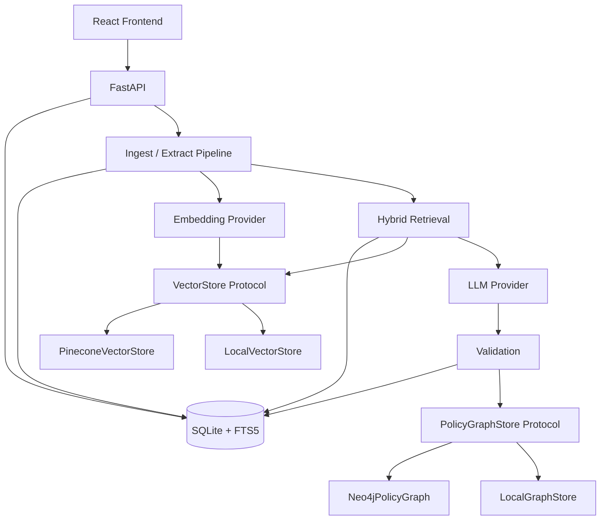

# Architecture

## Overview

PolicyLens is a monorepo with a FastAPI backend and a React/Vite frontend. SQLite stores application metadata and page text. Pinecone (or LocalVectorStore) powers semantic retrieval. Neo4j (or LocalGraphStore) stores validated, evidence-backed policy facts for explainability. QMS JSON is the authoritative extraction output.

## Services

| Layer | Role |
|-------|------|
| SQLite | Documents, pages, chunks, jobs, extraction JSON, audit |
| Pinecone / LocalVector | Semantic chunk search with metadata filters |
| Neo4j / LocalGraph | Validated policy relationships + comparison |
| LLM | Structured field extraction from retrieved evidence |
| Embeddings | Local sentence-transformers (384-d MiniLM by default) |

## Data flow

1. Upload PDF ? hash ? dedupe ? store file
2. Parse pages (PyMuPDF) ? tables ? OCR if needed
3. Chunk ? embed ? upsert vectors (document_id scoped)
4. Per field-group: hybrid retrieve ? LLM structured JSON ? Pydantic validate ? evidence check
5. Persist QMS JSON + validation metrics
6. Sync validated facts to graph store

## Adapter rule

Selecting `pinecone` or `neo4j` never silently switches to local. Health endpoints report failures explicitly.
